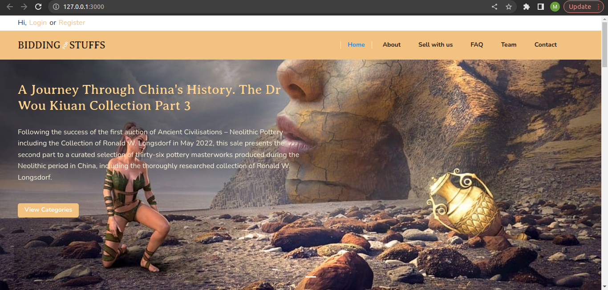
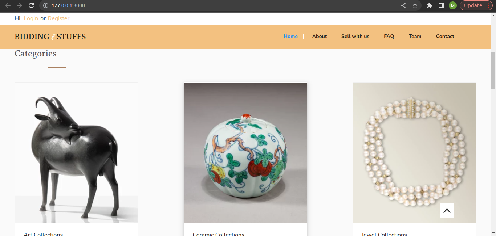
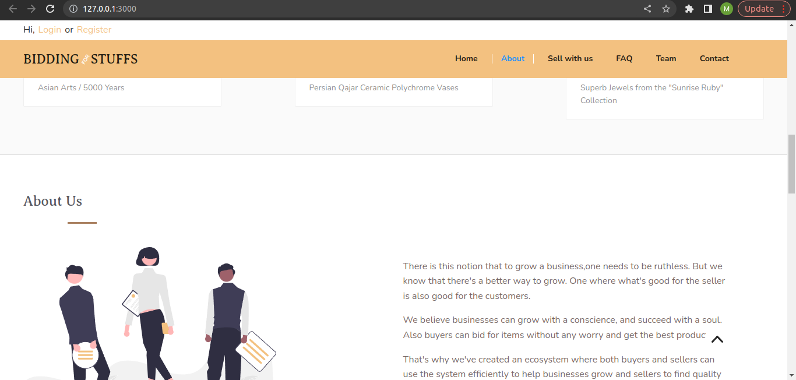
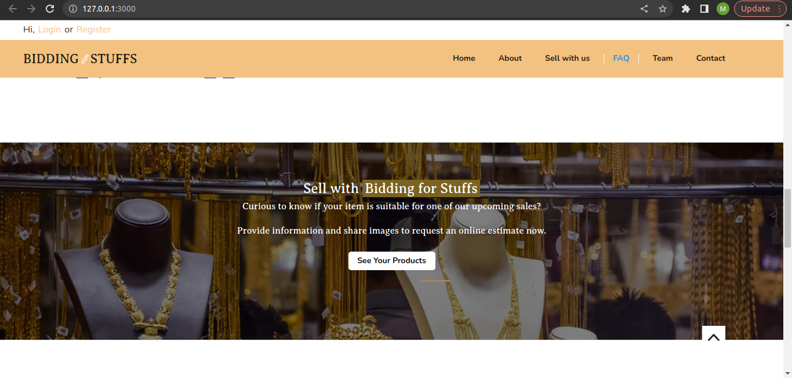
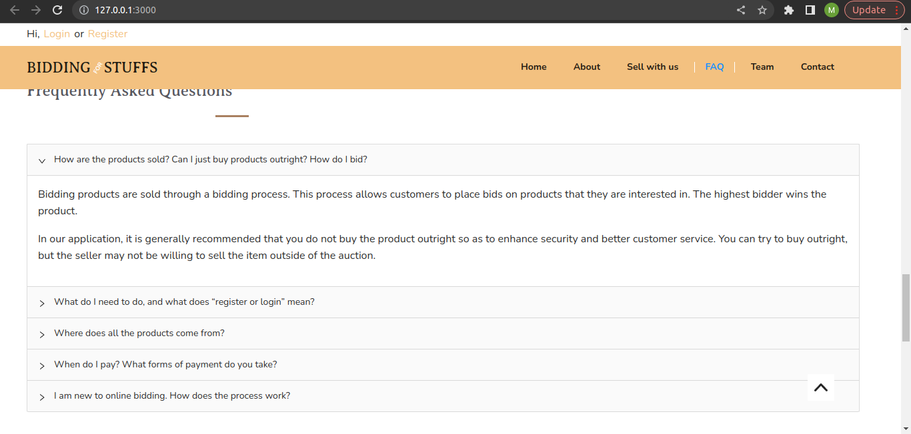
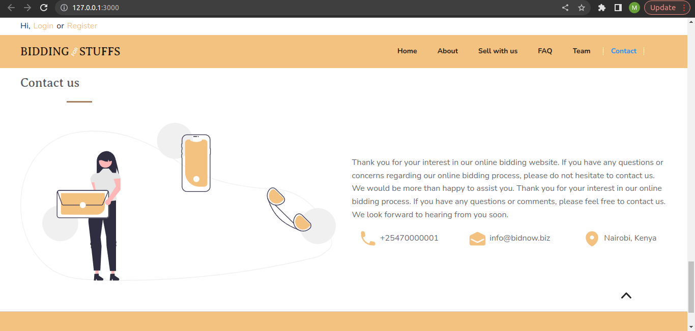
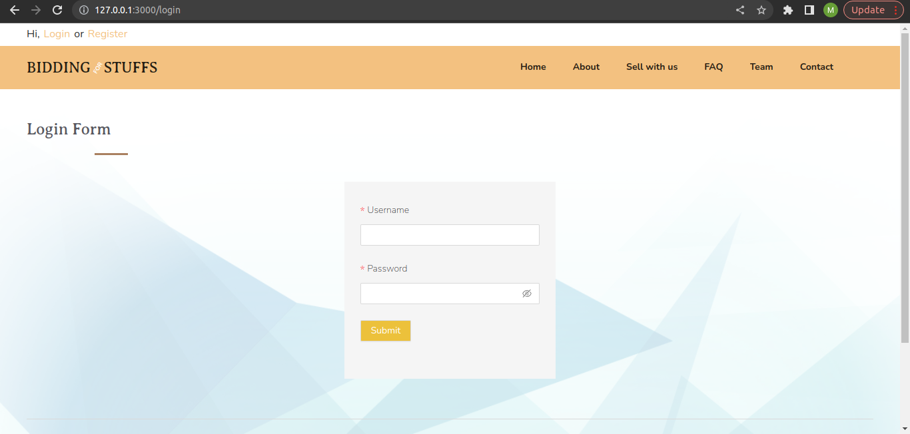
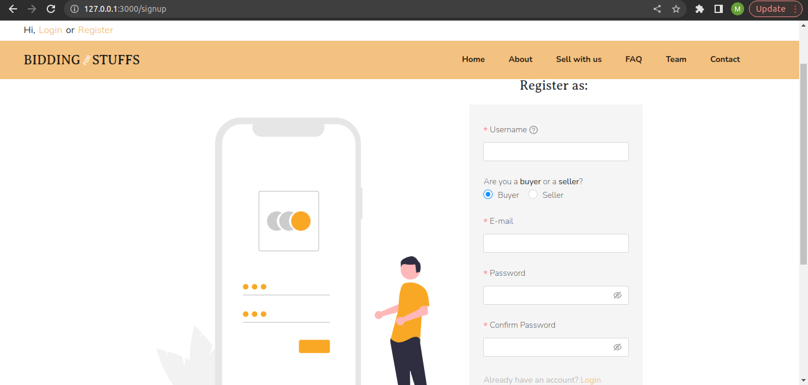
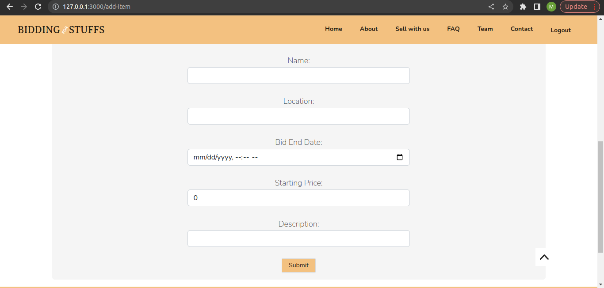
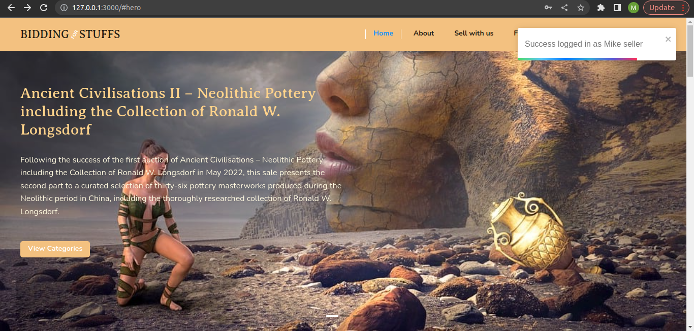

# README
<h1>Auctioning Platform</h1>













<hr>
<p>This is an online platform where users are allowed to create profiles and login either as buyers or users.A buyer can see all products with open bids:open bids have an active window till and expires with time.</p><h2>General Information</h2>
<hr><ul>
<li>One can only bid online
Payments can only be done online
One can only create an account only as a buyer or as a seller but not as both buyer and seller.</li>
</ul><ul>
<li>Advantages</li>
</ul>
<p>Saves time,<br>
Can be very exciting,
Items can be cheaper,
Very secure,
Its very convenient,
More selection of items,
More information about items.</p><ul>
<li>Creating a local online biding platform where one can bid for products.</li>
</ul><h2>Technologies Used</h2>
<hr><ul>
<li>HTML</li>
</ul><ul>
<li>CSS</li>
</ul><ul>
<li>JavaScript</li>
</ul><ul>
<li>Rails (API)</li>
</ul><ul>
<li>Vite React</li>
</ul><ul>
<li>Postgresql</li>
</ul><ul>
<li>Ant Design</li>
</ul><h2>Setup</h2>
<hr><p>A system where the products or goods can be purchased or sold through bidding. Generally, the bidding has a start price and no customer can bid less than the start price. Sellers should be able to add a product together with its start price and buyers should join a bid and suggest their prices, starting from the start price.</p><h5>Steps</h5>

<i>The following procedure presumes you have `npm`, `ruby` and `rails` gem installed already</i>

On the terminal, run the following:

```
bundle install
npm install
npm run dev
rails s
```

`bundle install` installs all ruby dependencies,
`npm install` installs all the javascript dependencies for the client side, `npm run dev` runs the server on the client side, 
`rails s` runs the backend server

<h2>Project Status</h2>
<hr><p>The project is complete.</p>
